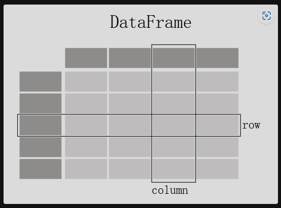

# what kind of data does pandas handle?

pandas data table representation



Each column in a DataFrame is a Series


你要想创建一个DataFrame

```python
import pandas as pd
df = pd.DataFrame(
	{
        "name":[
            "Braund",
            "Alen",
            "Vocky",
        ],
        "Age":[22, 23, 34],
        "Sex":["Male", "Female", "Male"],
    }
)
```

你要想创建一个Series

```python
ages = pd.Series([22, 23, 24], name = "age")
```

注意：Series是没有column label的。

从DataFrame中取出一列，其实取出来的就是一个Series

```python
df["Age"]
```

# Do something with a DataFrame or Series

计算某列最大值

```python
df["Age"].max()
```

计算所有基础的数据分析值

```python
df.describe()
```

注意：因为“Name”和“Sex”是texual data，所以不会计算这两列的值。

# How do I read and write tabular data?

读一个csv文件

```python
df = pd.read_csv("data/titanic.csv")
```

查看DataFrame

```python
#1
df
#2
df.head(10)
#3
df.tail(20)
#4
df.dtypes
#5
df,info
#
df.shape
```

把DataFrame写入excel文件（依赖openpyxl库）

```python
titanic = df.to_excel("titanic.xlsx", sheet_name="passengers")
```

# How do I select a subset of a DataFrame?

## How do I select specific columns from a DataFrame?

取一列

```python
age = df["Age"]
```

取多列

```python
age_sex = df[["Age", "Sex"]]
```

## How do I filter specific rows from a `DataFrame`?

满足单个条件的某些行

```\
above_35 = df[df["Age"] > 35]
```

满足多个条件的某些行

```python
class23 = df[(df["Pclass"] == 2) | (df["Pclass"] == 3)]
```

注意：1. 各子语句要用括号括起来 2. 要用 | 或 &。

某元素不为空的某些行

```python
age_no_na = df[df["Age"].notna()]
```


